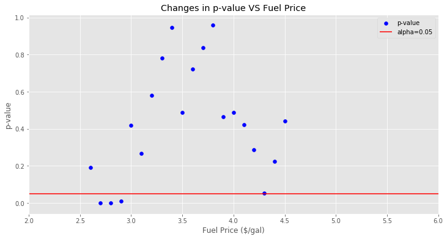

# Walmart Sales Analysis
![.](data:image/png;base64,iVBORw0KGgoAAAANSUhEUgAAAWgAAACMCAMAAABmmcPHAAAAwFBMVEX///8Acc7/wiAAbM0AZssAbs0AacwAbc0AZcv/vgAAaMx2pt/f6vcAY8rq8/vH3PKSt+TU5PVPktggftJAidbv9vwAYcqIsuOqx+oAdM+Rt+X3/P6bvueHseO1z+1Jjtf/9+UAWshqoN1cmNr//vm/1vDJ3fL/ykf/4Jxhm9sce9H/68F9q+A0hNT/5Kr/2oj/13z/8NL/xS3/6Lj/y03/9Nz/1HH/z13/4aH/+/D/5a7/0Wb/7sn/3ZH/y0n/xzoO7kOnAAARfElEQVR4nO1dfXuaPheGhgREQcVXBKXD6ibTrevef9uefv9v9eSdBKG21VavXrn/WQ2QhDuHk3NOTjLLMjAwMDAwMDAwMDAwMDAwMDAwMDAwMDAwMDAwMDAwMDAwMDAwOIzvn9/ff/t8fe5uvHl8brWurq5arV/n7sgbx1dCM0Hry7m78rbxQxL979xdedv4LIk2uuNF8UES/fXcXXnb+E8S/ffcXXnb+CiJ/n7urrxtfJFE/z53V942riXRN+fuytvGjST63D156xBE3527I28dnOern+fuyFvH/zjRP87dkbeOP1xFfz51xR2JhvJRfXFyoN7wsTe+AEb1r6Ti93XDhVumpFsf6i/fXD/XGlmOHQrvncZo9x0rdsYbtbjDi72xzv8+cl7vuwfe9qUwEW2HDTfc/Gi1rurDc9wHb/DAv7Zaz5X1KbIZnLVa3BPFdqwWL3gxHB6qtw14tWcguifabiD65q7VqB0+caI/1j1HY3ut98/qVMfjhKJULc6gINpTZXfLXwH1DtV7yUT/5GTeX+9f4z54XTj6yxW/dvusXsWcUDdXS4Hg2fZXSvGQ8+/0D1V7wURLN7suFsovtq73rnwuH9u/+AhsXK4NBkph35FEA1V4RbF7sNoLJvpWMnbV+lYNaXAffM8Dv75XnnrWooBU0kixD1Kpom0YlcWCfzfar6eCCyb6/ZWC6qz3u1Xrgf9qqQ/9eU6vOkJKVXUgxJwOQFksBgVND1Z7wUTfX2lM/9CFlzOqlf3+pvH8TLdRKGmVPVuBV1KVP569Cyb6VmetYujd0TKNyo/6A41G9gEsufSCtizqOArR/kKWD/hcGNfVo+OCif59VSVONfSu77Ct/F5V3T+qt98/z2kR+gDuZNECKUS7W1GcCBWtGShJGIb77ssBopOaZ3BZoxuZjOoaqamB/COI9pue+O+uItSaoff9i/rry1X13ueuJvalJS1fk7EEd5UBWPsVJdNP8wFwAs/z0K690mqtEN2dMtCvo7Md+Pghd6k8sspjXI0Xt/cMx3CxHdqkkcAvNlONu5DXyupJd04QENtJEG27gAANqlVibfC+Ql/Tove/yn3fjlhLFKJbzoYFVRGAd9gRxcIW8anc9Le2h1zh2EDgQ9XlqRCde4jAwYOWbALAnnK9AZf3buEJBRZEKpejdBcgIL0nF3m5og+6Y1qrR4ygFfQhl4pe6QVUPlUFf3+2WhqDdTfd3Gv3tP4ctZIolLQU1JHP+rdC+gBwWwQW+O/O0HPtClBRklAhmv+EmRXGCg3Q65Kr2wCWZcCV2iZpe0i5wi4rc0aXfWLuEgtBUJL6KKKxivijUl0b3fig3tC6vX4mwxxCUOVsuKL9d3M+J8oB4PYJIEq7G1RpJq+EJEeNRNs6cz6+vvT1Wlwp0/oFjkB+OSXRq0Ah9ZFE44nvtvWQl6h5g61/Ry/XCjdERoomtKMo5ZOfmPtGXJkjqhL35JlWYQs930B0tASVJ4ZWG1VqAZnoWl7bSiB0uyB6I0MGTyMaWyD/BNW1yXYiFa919esEi7WJeBuXs7SjQud3ufaGsfZafDKnegQC5DuOX37fQBgk9UTbsKoJ8HdU5Rkz2eW1LNi3hZW75/iSPjmcguh8Jup4KtFYDf+iZkXrf7VXmVV999+zydUQ8bfnrknCeu2NxAUewJsBtd/YKgR+0Z52O531NJOGd8CVRwPRtALkK0Nju6wMD1d5hxDpxLNd312mq36nv2jLh0SkkRMNo1g++WSiMb7et1r39YrhGuuM93Uh02dBKGnEphlmxZEpb8567DMB47SDCf0Vjt15aSN3xVcB5qygmWhUpP3+dKDJsR8t+us0looiELPqMFh2ZSOjoQiAFbxV/o1BPoB4BDXzDv/GcIqDDPxtNto+njB/d+1oJDHeydTIvlwRfebyxGm3Us27WPk6B41EIz7l5orYcUMi2UmRFfPvQvN3EvEA//a6ymQJ/WFvsZgSWRdEg+mCQrfwzwihpPlsyMw98q7c7CDmExZhPheCevdNkOQxYWwiGizFAwOpPRxhsI2EmCvhAA2CQj4QCtFg19m7qynwfz6I9RRIf7G/qbIFSjm3qqX+rEAsvnCBbyRamm4yPqvUuNWHfA/CN+UDURLtqr26XKJnKitcjKmpwUeASim/SV/yokg6/XV3o7s9DUQroirFF5UeiCCyLmwV4kbEbMKD5IpEq5/Z5RItgxhEm7GIkktXvwW5pJw7kPoqVrKaZzGxvXwxkfGBaCBaXRgroHYLrU7qDq1//XRZINKIZsUpROujf7lEi/cDM0twwgSTqws6GwrZUZ5bRcgHFcv4ANHKMAmFpfIhanHKok7bdsqYCieaxYkk0Z5G6eUSLRZd6azHJik2r4flbBgG5S0Mq8KpcdweT7Qw332FDynloiBcBjWNVInWNc0FEz3hvkhRqk52IZYvIoRbrsPkwZ6XdzzRgwrRU7/e1deJrrgkTyf6Y6NPcvP1pHssRI+9hP/p8gQlHmzAvqGImQqFOlQ8DggAkk7CKYmeBXojUkdXiNaNlKcS/emu1bqr9wy/Y8/w2ZH+GggxdtbcXRGCy20wfy3mQvGRLiXPwImjbS+VuTUnJHoqeXZ9OGxP0vT0RN98uHog/4iFlO4+nSz/n7sbmF9GqFiR7ctIKVMiwjybimUZF0zYrdJyOR3RI2m9Ocsus9+EwX8qon9/fmT07vggKQOXR7AVWllccDi/CWNWRN1j/sbuUDggL0C0+EhsIOMderbPsUR///GEePRpNuLzUAXMEqaipW3B7BGYcTeGk9IVIexYOgovQLTQTn4ZVzol0V+eusLy4wRb4sRXGq+RwpYlpSpmbozIG5voMQeC0xMtVo1Vp/90quOvnhTTqk2KuXmvrxn+PD6Ux9/QnTEVLfngATzIzA8RBBXLjIqbuDo50VPVjWIQntXDRMuIQnMq5tf7yur2p4Ybq6vgRwenhT4sGN+yXMTsmOoWHvRw33sW8aDTES3XMss0S/HZPEy0jK83ZK7xRRWVvmvl8ve/qor4spcDctxyy0JdB1XcP31tUKR+CKLL0MXo9Ha04EvJ14kepTpkSlB9oHE/U0nNDv1OMpW09ZbbE2UqMYQq0WqMZqkwLV9IFJavMnxkUOkJRMuxR8KymT3OYVnVx5oEqrl3dwdz76ofwPNy7zgKxaFWlZuSwVtqS7nzArF8sXUBKvecgGi5GQHu6B3hRgpDJXpXITqUfo6/m8+2WYXuSjZpJX+/Npv0zymySTnU5VM1SLlWEh59sc+lI18F2PmkPXDKUTod0dJYtyGK5tusXAYXC2YNRMsEWeq3A7+yD0TNj25VN6s05Ef/pzH9rPxogW5JKNTyzFWJloXDklkXaJFSbpicguhpqc4g0AOlDxM915bBFauFQs34/9mU8b9Xrhh6x6kORXfoqq0UdWUAOnuJSrDgr9XWnjoq1lFAvQ0b6InDTUSHWu+ETSqg7GHZN+qa97CUht7z9rBILGTvdPtTJCjpAzDVmYbBaqGu5J6G6LCSeefkwrFiK8RNRFuppzxVJdriGlc36ji+PrArixt6R++qzYXy0NeRrNV432omTKvbL+y1CJzylz5NmLQTK4rLDWYymZE5fY1Ea2mTZYI3B8sRrd/y89A+Q6Z06vNOn4SJg0g6sVft9roIEAkGI620kwXIhRiuDyZEwJIlvc2nV/OxR8F3zsqfCtFDUaYQHQe0KHjHfydbx6eNABQsaVUp7eQ7Gv7ovmM1BPsZ0KvYA5A9ON7LXbi5bVWMOgmxc7beK/lLkh1rrzwNo8VsPk9X+yGCfjqf9/RkFoxOb7krBtl2JSJL/V673WMRoFHIYek/ldXqUL+loWw0zXdFMcynoSzYticLalondVUIdLfZAPcuT9c1iSg31w0UHNgLbjU9Z/BEvNjpBgY6hJFtzut4YQgT7vgZz+BBmDOVXgfmlLBXgjn37pVQnuR4fe6uvG2Ys0lfCa9y2u5ovrOLvHv4xhMiWS5FtLizmT105zRavsKBY69xfnTHJ0EE4O1e8wC1MEAi9hqD4KFjQNooOLzr/mi8xonoA+gO55Hjwlcl2pcLwYeIBrWHFSTDIQvepsNTSIhcFHi5M/47AY3rd7JX1R0K0f2sGs7U0ED0yOPbvNro4Fl8j0A5Gb7Y/1qxdvRjOF4HCtEHgImuk9jE50s6WxCc4lP8x/8flqaEmuMROsqunX4vj3L8qzOb0fXYWQ9/1Um6ieZlQHKyshabaJZY/XaU8/yOKb6jwy+ucBVdWbwlxb0e/czTnlyqUYhez3rJaDZbsDvIxLjIo62MX7eBm7JOEXS20YYomv7chcN01rHSDIIJq1d0ojuxwnbUfmLa//W/b/c/P7zkeehtZDtDTtjAQz4IIisc+2R1bhoEc6sDydkYgRwMF0UeAv5uFiAXjAkxnZgE/unhA8jJySrAmPwdxj7yEfnTRmPMQGfsywx9hehtgC+6iMhlf+xn1mjgkMcmonvARrhGj2aS4DZxncXI2npkjTxIE7KigtuWreFRmI03AIHxwSP6Xh1LD0KnYAdoDNrbAmJSc0BO1CignyQudLcTG4rN3lZsuygryBLGcAfInoAEQjTIECRzGkkdJ8WEtthF7VkMg77VQyRLa6IcuaEQPQEeFkxEFiY3rte3dgDlPdoJCkL0DteOcrqMtuttkDu0UrGzia1aFbS1LW4N8zsDrj8YNmyLPCtWAwfC8jQMCHKr47mR1XXA3Johst4X+kBMWbGN+sRWIXvjsAJdWXPkT4lEQUiIlsVThPBYJQBsrNAjqU0FLHd2VYm2XBiz21YeTZ2zXb6w1gbkMJAwJsuFsUs+iYmLBz1BUkfTswFSRJJ8sebOMdH1mUqXgDURwj7xXbJdXpDtqEs3SDLojKwdhFGWRfLFrZimC2EuQ7KTCLNSsHM2Fj4WR5ZL1PVxceTCKMIPkqSXzEXJ2gET2eAe0Sly1vivNa4YZvixGPKES251YJFfdDx7gC8NIZ5URspkSK5HkLS2JK3NgH+GI8oeiyHEIhsC5Ng+JOLX92AE3DbN/iHHPwBffIuM6C0lmjIK2bo+dnwWFluYXpPiAWQPkjOkFr7fZUPDsUd0gvmlNS9dG/i+DwAXf050Fw/p2mdHUYBgtUc0a80nrV0q0Qm1jqYIv3kbgD7RdoTTDEJ6qsMOy0iC75E21B7RA02iJdGRC+SDCXLzWD1wc49oa4Kg7TG1M0oo2GWsOka0f0SiQU9UuSfRrisuXSrRS5uYHBFEcysDxNZgRPcDdqzMhE5k1kJ6BXtESx2NP3aF6NSnG29X9KVzAG1nRWZb5gWGPnaTGJ2c6JHPckUXDju7SRgNePBxNaMYEh0NY9xoMqW385HaujSFBKsW0hpZsWdEr3ebMxzK/gD6Y+gXWQzIdt8tnkb6OWJJuUNmaIwQ9LP2LpCW2R7RIxeiYQSY1VESjf9Gw/bQo+lya4fq6tUYjtnWXEyrgz/1YCOIxjWyYyUGLtrhxyAfWayz0W4JmdXhQXezgcSGw90Am+GcJOrBQW4nFoQ+bi0oBNHAdaqZSmfGjKXPEGshxKo4CAYsk6Y7ZiLTx0YptqOluQSoNdz2xoToMWG3b2OVCkg+kYXoxTUt7uBihHiwClspKSHaZYfMhAE9AxA4G2wSc+4DlsEYFuQxRxzxlgcRiXo5tE/bgOTzeIToNHDZcXrYiEfvukprE1ohBF45914GwnSTLVMqQJ12tsQfPbOOIq7pRr0oy8vTCdIJec/VBPuGVjinvliSRhk7ipFdDCeyWDyIVRNpoTfkh85MZhSThbWeTNg3PhdW9nSZbaTFvZjwXlH021k0Y0OwwG0S93W0zSJyKo5srT+ZjEgIpeGQlbcNPI9tDt9lcDSwAl4fvsvgaLiw5kRWg5NjGniHD1M3OB5pFl2WUWtgYGBgYGBgYGBgYGBgYGBgYGBgYGBgYGBgYGBgYGBgYGBgcEL8H+9SSEbeuynIAAAAAElFTkSuQmCC)

## Overview and Scope
One of the leading retail stores in the US, Walmart data has been used to obtain an insight of Weekly Sales at forty-five different locations over the years from January,2010 to December,2012. There are several factors that impact the weekly sales of a store in which Store Location, Holiday Week Markdowns, Fuel Price, Consumer Price Index (CPI) and Unemployment Index are taken into account.
Hypothesis Analysis will be used to conclude the impact of above mentioned factors on sales.

---

### Sale
Walmart's monthly sales are analyzed over three years and the plot is shown below. The plot shows overall similar monthly sales across *45* stores except some outliers.

In order to get an insight for the scope of improvement, semesterly and quarterly sales were analyzed per store. The plots are shown below respectively. 

**semester and quarterly sale images**

It was noticed that second semester of 2012 had minimum sale and specially forth quarter of 2012 had drastically low sale. 

---

### Location of the stores
It is interesting to see how different locations change the sales of the stores. A graph was plotted for all the stores against their total sales for two years as shown below. 

Out of all the locations under analysis, *40%* of the stores (18 of 45) have their sales below *60%* of the highest sale obtained by store with store ID *14*. It was interesting to notice that hightest selling store (store ID: 14) also has highest standard deviation from its average weekly sale. 

---

### Holiday markdown week VS Non-Holiday week sale.
To have an insight of how holiday markdown week sales do with respect to non-holiday weeks, a graph is shown below. There are 10 holiday markdown sale weeks (for each location of the store)  and 133 non-holiday weeks (for each locations of the store) for a duration of three years.

It was observed that the average sale of a holiday markdown week is $81,000 more than the average non-holiday week sale.  

---

### Impact of Unemployment on Sales
In order to test the impact of Unemployment on Sales, Welch's Hypothesis testing is used. Unemployment Indices varied between 3.88 to 14.31 over the years of interest (2010-2012).   For the testing, below given hypothesis was defined:

**H0: There is no impact of Unemployment on sales**  
**H1: There is an impact of Unemployment on sales**  

Rejection threshold for the test is selected as 0.05 and p-value for sale is calculated against all unique Unemployment Indices.   Below is the obtained graph:

As seen above, there is an impact from Unemployment Index on sales for the range 3.8 to 6.2 and 7.9 to 14.3.  Therefore, **Null hypothesis is rejected** 

---

### Impact of Consumer Price Index (CPI) on Sales
For testing the impact of CPI on sales, Welch's Hypothesis is used. Below defined is the Null hypothesis and the Alternate Hypothesis:  

**H0: There is no impact of CPI on sales**  
**H1: There is an impact of CPI on sales**  
The rejection threshold for the test is selected as 0.05. Below is the obtained graph for different p-values over the range of CPI.

CPI impacts the sales when in range 139 to 142 and 182 to 227. Therefore, Null hypothesis is rejected for these ranges. 

---

### Impact of Fuel Price on Sales
Again, Welch's hypothesis testing is utilized to inspect the impact of different fuel prices. Fuel price ranged between 2.47 to 4.45 and p-value is calculated over all different values of fuel. 
The rejection threshold is selected as 0.05. Below is the defined Null Hypothesis and Alternate hypothese: 
**H0: There is no impact of fuel price on sales.** 
**H1: Fuel price impacts sales.** 

The observed plot is shown below. Obtained p-value is way above than the alpha. Therefore, this test **fails to reject Null Hypothesis.**  

---

## Conclusion
Based on all the impact analysis, it is concluded that: 
> Sales change as per the location of the store. 
> Holiday markdown week sales are highter than non-holiday week sales. 
> There is an impact of Unemployment Index on sales. 
> There is an impact of CPI on sales. 
> There is no impact of fuel price on sales.  

## Suggestions
1. Relocate stores which are below 60% of highest sales.
2. Increase Markdown weeks.
3. There is an impact of Unemployment Index on sales, so prices and inventory should be changed accordingly.
4. There is an impact of CPI on sales, markdown weeks should be increased in high CPI times.
5. There is no impact of fuel price. 

